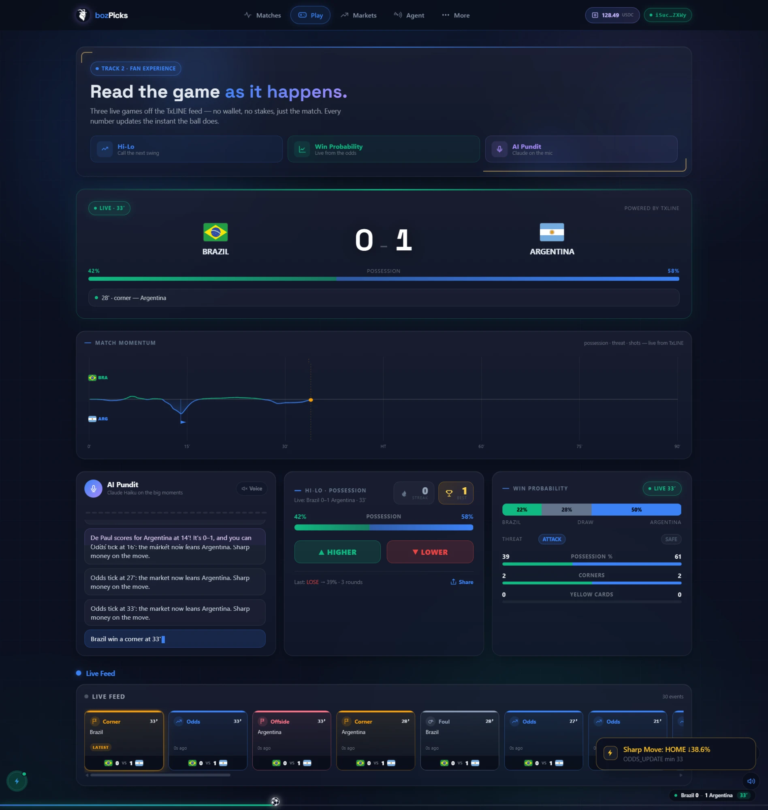
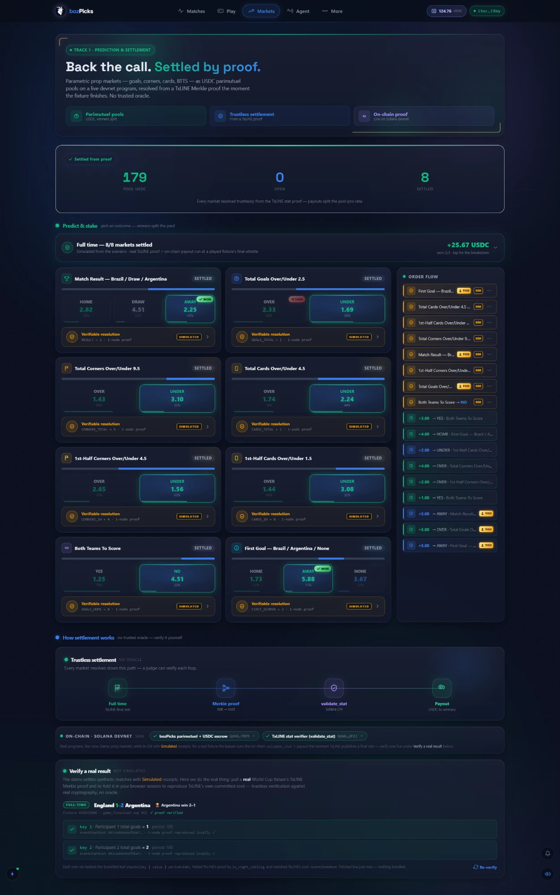

<div align="center">

# bozPicks

**Pick smart. Watch live. Get paid on-chain.**

One live [TxLINE](https://txline.io) data core → three World Cup products:
a fan game, a trustless prediction market, and an autonomous trading arena.

Built for the **TxLINE World Cup Hackathon** — submitted to **all three tracks**.

[**▶ Live app**](https://boz-picks.vercel.app/) ·
[Fan game](https://boz-picks.vercel.app/play) ·
[Markets](https://boz-picks.vercel.app/markets) ·
[Agents](https://boz-picks.vercel.app/agent) ·
[On-chain program (devnet)](https://explorer.solana.com/address/GxH4pi5NY8qKd9vNuYqYT6UWW7jTsjaCFFy233KFTNYh?cluster=devnet)

</div>

---

## Table of contents

- [What it is](#what-it-is)
- [Judge it in 60 seconds](#judge-it-in-60-seconds)
- [The three products](#the-three-products)
  - [Track 1 · bozSettle — prediction markets & settlement](#track-1--bozsettle--prediction-markets--settlement)
  - [Track 2 · bozPicks — consumer & fan experience](#track-2--bozpicks--consumer--fan-experience)
  - [Track 3 · bozAgent — trading tools & agents](#track-3--bozagent--trading-tools--agents)
- [Architecture](#architecture)
- [How data flows](#how-data-flows)
- [On-chain settlement](#on-chain-settlement)
- [The vault economy (honest by design)](#the-vault-economy-honest-by-design)
- [TxLINE endpoints used](#txline-endpoints-used)
- [Monorepo layout](#monorepo-layout)
- [Tech stack](#tech-stack)
- [Database schema](#database-schema)
- [Environment variables](#environment-variables)
- [Quick start (local)](#quick-start-local)
- [Deployment](#deployment)
- [Testing & determinism](#testing--determinism)
- [Screenshots](#screenshots)
- [Documentation index](#documentation-index)

---

## What it is

Most hackathon entries repackage a data feed once. bozPicks builds **one data
core** — a rich TxLINE ingest + replay engine — and then three **sharply-focused
hero products**, each nailing a different track's rubric:

| Track | Product | Page | The hero |
|---|---|---|---|
| **1** · Prediction Markets & Settlement | **bozSettle** | [`/markets`](https://boz-picks.vercel.app/markets) | 8 USDC parimutuel prop markets, settled from a TxLINE **Merkle proof** (`validate_stat`), with a verifiable-resolution receipt for every result |
| **2** · Consumer & Fan Experiences | **bozPicks** | [`/play`](https://boz-picks.vercel.app/play) | Hi-Lo stat game, Match Momentum curve, win-probability gauge, AI pundit with neural TTS, and a one-signature devnet vault |
| **3** · Trading Tools & Agents | **bozAgent** | [`/agent`](https://boz-picks.vercel.app/agent) | Three fully-autonomous agents (Sharp-Move Detector, Momentum-vs-Contrarian Arena, In-Play Market Maker) off one live odds feed |

Everything is driven by **real TxLINE data**. Because a hackathon demo can't wait
for a goal to happen on cue, an in-app **Command Bridge** replays any fixture
(live or historical) through the exact same SSE pipeline at 1× / 8× / 60× — so
every widget on every page can be shown reacting live, on demand.

---

## Judge it in 60 seconds

1. Open any page and tap the **⚡ Command Bridge** (bottom-left corner).
2. Pick a **real TxLINE fixture** (live from `/api/fixtures/snapshot`) or the
   built-in preset, choose the exact outcome scenario + speed, and hit **Run**.
3. Every page goes live off one SSE stream: the event feed, Hi-Lo, the AI pundit
   (neural voice with a commentator picker + energy control), the broadcast
   **Match Momentum** curve, the win-probability gauge, and the agent arena — and
   at full time all **8 prop markets** settle to your chosen outcome with
   verifiable-resolution receipts, honestly labelled **Simulated** (upcoming
   fixture) vs **Verified** (real on-chain proof).
4. Prove determinism offline: `pnpm --filter=web test` — **38 tests, no mocks** —
   the exact pure functions the demo, the markets, and the keeper all run.

> **Two-phase live demo:** each track's video records **Phase A** on a *real*
> live match (to prove it works on genuine data) and **Phase B** on a replayed
> match (to show the full controllable cycle through settlement). Scripts live in
> [`docs/video-script-track{1,2,3}-*.md`](docs).

---

## The three products

### Track 1 · bozSettle — prediction markets & settlement

**Trustless parimutuel prop markets, resolved by cryptographic proof — not by us.**

- **8 prop markets** auto-created per fixture, all settleable from TxLINE's
  provable stat map:

  | Market | Line | Stat source |
  |---|---|---|
  | Match Result (1X2) | — | goals 1 / 2 |
  | Total Goals O/U | 2.5 | goals total |
  | Total Corners O/U | 9.5 | corners 7 / 8 |
  | Total Cards O/U | 4.5 | yellow 3/4 + red 5/6 |
  | 1st-Half Corners O/U | 4.5 | corners, period H1 |
  | 1st-Half Cards O/U | 1.5 | cards, period H1 |
  | Both Teams To Score | — | goals home & away |
  | First Goal Scorer | — | first goal event |

- **Parimutuel pools in USDC** — stakes pooled, winners split the pot pro-rata
  minus a fee (`packages/shared/src/utils/parimutuel.ts`).
- **Trustless settlement:** the keeper watches the scores stream; on
  `game_finalised` (period 100) it fetches TxLINE's
  `/api/scores/stat-validation` **Merkle proof**, runs `validate_stat` + `settle_pool`
  **on Solana devnet**, and marks the pool settled — atomic: both instructions
  pass or both fail.
- **Verifiable Resolution UI** — every settled market shows its *receipt*: the
  winning outcome, the exact stat, the Merkle proof, and a link to the on-chain
  validation tx. Results labelled **Verified** carry a real proof; upcoming
  fixtures show **Simulated** so nothing is ever over-claimed.
- **Live real-proof verifier** (`/markets` → *Verify a real result*): fetch and
  verify a genuine finished-match proof end-to-end, nothing bundled.

Related: [`apps/web/src/lib/markets.ts`](apps/web/src/lib/markets.ts),
[`settle.ts`](apps/web/src/lib/settle.ts),
[`apps/keeper`](apps/keeper), [`programs/settlement`](programs/settlement).

### Track 2 · bozPicks — consumer & fan experience

**A phone-first World Cup companion where every number is live.**

- **Hi-Lo Stats Game** — "will the next stat (corners / possession / shots) be
  higher or lower?" Guess before each TxLINE tick, build a streak, share the
  card. ([`lib/hilo.ts`](apps/web/src/lib/hilo.ts))
- **AI Pundit** — Claude explains each goal / red card / big odds swing in one
  line, spoken with **neural TTS** (Groq / Deepgram / ElevenLabs / OpenAI, with a
  browser-voice fallback), a commentator picker and an energy dial.
- **Match Momentum** — broadcast-grade two-sided momentum curve computed live from
  possession, danger state, and attacking events. ([`lib/momentum.ts`](apps/web/src/lib/momentum.ts))
- **Win-probability gauge** from the consensus implied probability — swings on
  every goal.
- **Live event feed & scoreboard** — every TxLINE event type gets its own colour,
  icon, and match-identity footer; a **Quiet mode** suppresses odds spam during a
  fast-repricing real match.
- **Cinematic FX** — a goal fires a shockwave + sound + the ball flies to centre;
  reduced-motion aware, and de-duplicated so a re-delivered event never replays.
- **One-signature vault** — deposit once, stake instantly with no more pop-ups,
  cash out; each movement anchored on-chain by a signed memo (see
  [The vault economy](#the-vault-economy-honest-by-design)).

### Track 3 · bozAgent — trading tools & agents

**Three fully-autonomous agents off one live odds feed — no human in the loop.**

- **Sharp-Move Detector** — flags significant odds moves (configurable threshold /
  window), then **self-grades** each signal against the final result and reports
  live accuracy at `/api/agents/stats`. Stale, ungraded signals are reconciled
  automatically. ([`apps/agent`](apps/agent))
- **Momentum-vs-Contrarian Arena** — two agents read the same feed, run opposite
  strategies, open notional positions, and compound the better strategy over the
  match. ([`packages/shared/src/strategy/arena.ts`](packages/shared/src/strategy/arena.ts))
- **In-Play Market Maker** — Avellaneda-Stoikov-style quoting around the implied
  price, widening spreads on danger state.
  ([`packages/shared/src/strategy/marketmaker.ts`](packages/shared/src/strategy/marketmaker.ts))
- **Production-readiness signals** — deterministic, unit-tested strategy math;
  runs headless with SSE reconnect/backoff; a belt-and-suspenders REST poller
  backs up both the scores and odds streams so a silent stream never blinds the
  agents.

---

## Architecture

```
                         TxLINE World Cup feed
      fixtures · scores SSE · odds SSE · stat-validation (Merkle) proofs
                                  │
              ┌───────────────────┼────────────────────┐
              ▼                   ▼                     ▼
        boz-ingest            boz-agent              boz-keeper
   scores+odds SSE →      3 autonomous          on game_finalised:
   Redis + Postgres      strategies →           fetch Merkle proof →
   (+ REST poller           signals →           validate_stat + settle_pool
    backstop)            Redis / Postgres        on Solana devnet
              │                   │                     │
              └─────────► Redis pub/sub ◄───────────────┘
                                  │
                                  ▼
                    apps/web  /api/stream  (SSE, catchup-flagged)
                                  │
      ┌───────────────┬──────────┼───────────┬────────────────┐
      ▼               ▼          ▼           ▼                ▼
   Live feed        Hi-Lo    AI pundit    Markets          Agent arena
   + momentum     + streak   + neural    + verifiable      + MM quotes
   + win-prob                  TTS        receipts
```

**One SSE stream, every page reacts.** `apps/ingest` (and the demo replayer)
publish normalized `BozEvent`s to Redis pub/sub; `apps/web`'s `/api/stream` fans
them out to browsers with a catch-up flag so a page that joins mid-match still
paints correctly. Postgres (Neon) is the durable store for matches, events,
signals, pools, markets, predictions, and the vault ledger.

---

## How data flows

1. **Ingest** — `apps/ingest` connects to TxLINE's scores + odds SSE (and a REST
   snapshot poller as backup), normalizes each record into a `BozEvent`, writes
   it to Postgres, and publishes it to Redis.
2. **Fan-out** — `apps/web` `/api/stream` subscribes to Redis and streams events
   to every connected browser over Server-Sent Events.
3. **React** — client contexts (`SSEContext`, `LiveMatchContext`, `VaultContext`)
   turn the stream into live UI: feed, Hi-Lo, pundit, momentum, markets, arena.
4. **Settle** — when a match reaches `game_finalised`, the keeper fetches the
   Merkle proof and settles on devnet; markets flip to a verifiable receipt.
5. **Replay** — the Command Bridge re-emits any fixture through the *same* Redis →
   SSE path, so demos are identical to production behaviour.

---

## On-chain settlement

Anchor program on **Solana devnet** — [`programs/settlement/src/lib.rs`](programs/settlement/src/lib.rs).

- **Program ID:** [`GxH4pi5NY8qKd9vNuYqYT6UWW7jTsjaCFFy233KFTNYh`](https://explorer.solana.com/address/GxH4pi5NY8qKd9vNuYqYT6UWW7jTsjaCFFy233KFTNYh?cluster=devnet)

| Instruction | Who | What |
|---|---|---|
| `create_pool` | keeper | open a parimutuel pool for a match |
| `place_prediction` | user | escrow USDC into the pool PDA for an outcome |
| `settle_pool` | keeper | set the winning outcome (0=HOME 1=DRAW 2=AWAY) after the TxLINE `validate_stat` CPI |
| `claim_payout` | winner | withdraw a proportional share of the escrow |

The keeper bundles TxLINE's `validate_stat` proof with `settle_pool` in a single
transaction, so a pool can only be settled against a **verified** stat — settlement
is cryptographic, never self-asserted. `TxL is data-authorization only — all value
flows are USDC/SOL.`

---

## The vault economy (honest by design)

The fan-facing balance is a **devnet-simulated USDC ledger**, kept frictionless on
purpose: you sign **once** to fund it, then stakes debit instantly with no more
wallet pop-ups, and cash-out adjusts the balance.

Each deposit and cash-out signs **one devnet memo transaction** that *anchors* the
movement on-chain (e.g. `{"bozVault":"withdraw","amountUsdc":50}`) — verifiable on
Explorer — but a memo **does not transfer tokens**, so your wallet's real SOL/USDC
is intentionally unaffected. The vault modal states this plainly. The full
on-chain USDC escrow path (`place_prediction` / `claim_payout`) is implemented in
the Anchor program above; the demo runs stakes through the simulated ledger for a
smooth fan UX while settlement itself stays real and proof-backed.

See [`VaultContext.tsx`](apps/web/src/contexts/VaultContext.tsx),
[`lib/vault.ts`](apps/web/src/lib/vault.ts).

---

## TxLINE endpoints used

| Endpoint | Used for |
|---|---|
| `GET /api/fixtures/snapshot` | fixture list; the Command Bridge fixture picker |
| `GET /api/scores/snapshot` · `/updates` · SSE stream | live scores, events, possession, corners, cards, lineups |
| `GET /api/scores/historical` | replay engine (past matches) |
| `GET /api/odds/snapshot` · `/updates` · SSE stream | 1X2 + `SuperOddsType` markets, implied probability, agent signals |
| `GET /api/scores/stat-validation` | the **Merkle proof** the keeper verifies on-chain |

Stat-key legend, settlement rules and API feedback are in
[`docs/TXLINE-REFERENCE.md`](docs/TXLINE-REFERENCE.md).

---

## Monorepo layout

```
bozPicks/
├── apps/
│   ├── web/         Next.js 15 UI + API routes + SSE fan-out  (→ Vercel)
│   ├── ingest/      TxLINE SSE/REST worker → Redis + Postgres  (→ Railway)
│   ├── agent/       Headless Sharp-Move + Arena + Market Maker (→ Railway)
│   └── keeper/      Merkle proof fetch + validate_stat settlement (→ Railway)
├── packages/
│   ├── shared/      Types, parimutuel math, arena + market-maker strategy
│   └── txline-client/  Typed TxLINE REST + SSE client
├── programs/
│   └── settlement/  Anchor program (Solana devnet)
├── docs/            Per-track READMEs, submissions, demo/video scripts, DB schema
├── Anchor.toml · turbo.json · pnpm-workspace.yaml
```

---

## Tech stack

- **Frontend / API:** Next.js 15 (App Router), React 18, Tailwind CSS, TypeScript,
  Server-Sent Events.
- **Workers:** Node + `tsx`, `ioredis`, `pg`.
- **Data:** Postgres (Neon), Redis (Upstash) pub/sub.
- **Chain:** Solana devnet, Anchor (`@coral-xyz/anchor`), `@solana/web3.js`,
  wallet-adapter (Phantom + Solflare).
- **AI:** Anthropic Claude (pundit explanations) + neural TTS
  (Groq / Deepgram / ElevenLabs / OpenAI, browser fallback).
- **Tooling:** pnpm workspaces + Turborepo.

---

## Database schema

Postgres tables (migrations in [`docs/db`](docs/db)):

| Table | Holds |
|---|---|
| `boz_matches` | fixtures + live status/score |
| `boz_events` | normalized live event log |
| `boz_replay_events` | recorded events for replay |
| `boz_signals` | agent signals + self-grading accuracy |
| `boz_pools` | parimutuel pools + winning outcome |
| `boz_predictions` | user predictions / stakes |
| `boz_markets` | prop-market definitions + receipts |
| `boz_explanations` | cached AI pundit lines |
| `boz_vault` · `boz_vault_ledger` | vault balance + movement ledger |

Apply them with:

```bash
for f in docs/db/*.sql; do psql "$DATABASE_URL" < "$f"; done
```

---

## Environment variables

Copy `.env.example` → `.env`. The essentials:

| Var | Required | Purpose |
|---|---|---|
| `TXLINE_API_KEY` | ✅ | TxLINE REST + SSE auth |
| `DATABASE_URL` | ✅ | Postgres (Neon) |
| `REDIS_URL` | ✅ | Redis (Upstash) pub/sub |
| `ANTHROPIC_API_KEY` | — | AI pundit explanations |
| `GROQ_API_KEY` / `DEEPGRAM_API_KEY` / `ELEVENLABS_API_KEY` / `OPENAI_API_KEY` | — | neural TTS (set one; falls back to browser voice) |
| `NEXT_PUBLIC_SOLANA_NETWORK` | — | `devnet` (default) |
| `NEXT_PUBLIC_RPC_URL` | — | dedicated devnet RPC so signatures land reliably |
| `BOZPICKS_PROGRAM_ID` | — | Anchor program id (default set) |
| `SETTLEMENT_KEEPER_KEYPAIR` | — | keeper signer (JSON byte array) — **keep out of git** |
| `SHARP_THRESHOLD` / `SHARP_WINDOW_MS` | — | Sharp-Move Detector tuning |
| `LOG_EVENTS` | — | verbose event logging |

---

## Quick start (local)

```bash
# 0. prerequisites: Node ≥ 20, pnpm 9, a Postgres URL, a Redis URL, a TxLINE key
cp .env.example .env         # fill in TXLINE_API_KEY, DATABASE_URL, REDIS_URL
pnpm install
for f in docs/db/*.sql; do psql "$DATABASE_URL" < "$f"; done

# 1. run the web app (UI + APIs + the Command Bridge that drives demos)
pnpm --filter=web dev        # http://localhost:3000

# 2. optional workers (not needed for replay demos — the Command Bridge covers it)
pnpm --filter=ingest dev     # live TxLINE ingest → Redis + Postgres
pnpm --filter=agent dev      # headless agents
pnpm --filter=keeper start   # Merkle-proof settlement (needs a funded keeper key)

# 3. prove the logic deterministically (no mocks)
pnpm --filter=web test       # 38 tests
```

For a **fully live** (non-replay) run you also need `ingest` (and `keeper` for
real settlement) deployed against a live fixture window.

---

## Deployment

- **`apps/web` → Vercel** — [`boz-picks.vercel.app`](https://boz-picks.vercel.app/).
  Set all env vars in the Vercel project. Optional per-track subdomains
  (`agent.` / `settle.` / `picks.bozpicks.com`).
- **`apps/ingest`, `apps/agent`, `apps/keeper` → Railway** — long-running Node
  workers. `ingest` must be redeployed whenever the fixture window changes so the
  right match is polled; the keeper needs a funded `SETTLEMENT_KEEPER_KEYPAIR`.
- **`programs/settlement` → Solana devnet** — built/deployed with Anchor
  (`Anchor.toml`).

---

## Testing & determinism

Every value-bearing rule is a **pure function** with a unit test — no network, no
mocks — so the demo, the markets UI, and the keeper all compute results the same
way a judge can verify offline:

```bash
pnpm --filter=web test
```

| Suite | Covers |
|---|---|
| `settlement.test.ts` | all 8 prop markets resolve correctly from final stats |
| `statkeys.test.ts` · `statproof.test.ts` | TxLINE stat-key mapping + Merkle proof verification |
| `momentum.test.ts` | Match Momentum curve |
| `hilo.test.ts` | Hi-Lo scoring |
| `arena.test.ts` · `marketmaker.test.ts` | agent strategy math |

**Honesty guarantees:** upcoming-fixture receipts are stamped `SIMULATED`; real
proofs are `VERIFIED`; timestamps are absolute (never "3h ago", which goes stale
mid-video); and the vault plainly states it moves no real tokens.

---

## Screenshots

> _Add images here._ Drop files into `docs/assets/` and reference them below.
> Suggested set (send me these and I'll wire them in):

| File | Shot |
|---|---|
| `docs/assets/play.png` | `/play` — Hi-Lo + momentum + pundit during a live match |
| `docs/assets/markets.png` | `/markets` — the 8 prop markets |
| `docs/assets/receipt.png` | a settled market's verifiable-resolution receipt |
| `docs/assets/agent.png` | `/agent` — the arena + sharp-move accuracy dashboard |
| `docs/assets/command-bridge.png` | the Command Bridge fixture/scenario picker |
| `docs/assets/vault.png` | the vault modal (deposit → stake → cash out) |

<!--
Example once files are added:


-->

---

## Documentation index

| Doc | What |
|---|---|
| [`docs/WINNING-STRATEGY.md`](docs/WINNING-STRATEGY.md) | the three-track strategy + rubric mapping |
| [`docs/TXLINE-REFERENCE.md`](docs/TXLINE-REFERENCE.md) | full TxLINE API reference + stat-key legend |
| [`docs/README-track1-bozSettle.md`](docs/README-track1-bozSettle.md) | Track 1 brief |
| [`docs/README-track2-bozPicks.md`](docs/README-track2-bozPicks.md) | Track 2 brief |
| [`docs/README-track3-bozAgent.md`](docs/README-track3-bozAgent.md) | Track 3 brief |
| [`docs/submissions/`](docs/submissions) | per-track submission text (idea · endpoints · API feedback) |
| [`docs/video-script-track{1,2,3}-*.md`](docs) | two-phase demo-video scripts |
| [`docs/DEMO-SCRIPTS.md`](docs/DEMO-SCRIPTS.md) | click-by-click demo walkthroughs |

---

<div align="center">

**Powered by TxLINE · Settled on Solana devnet · Built as one monorepo, three products.**

</div>
